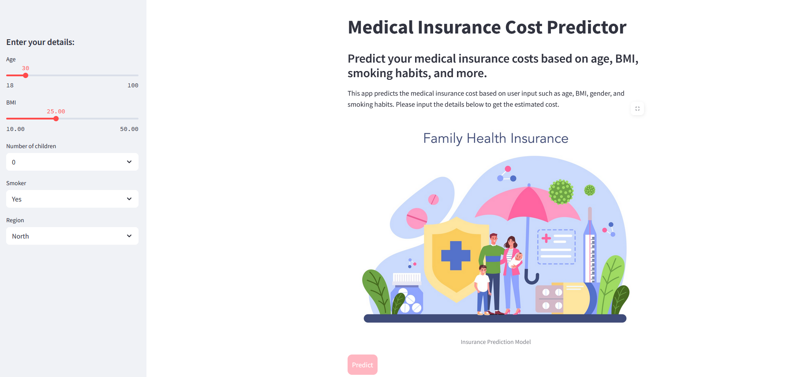
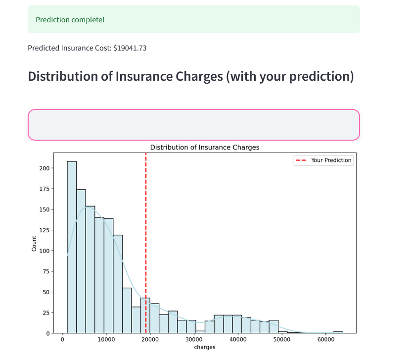
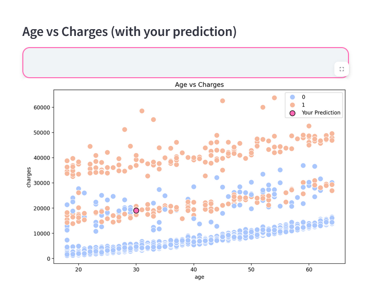
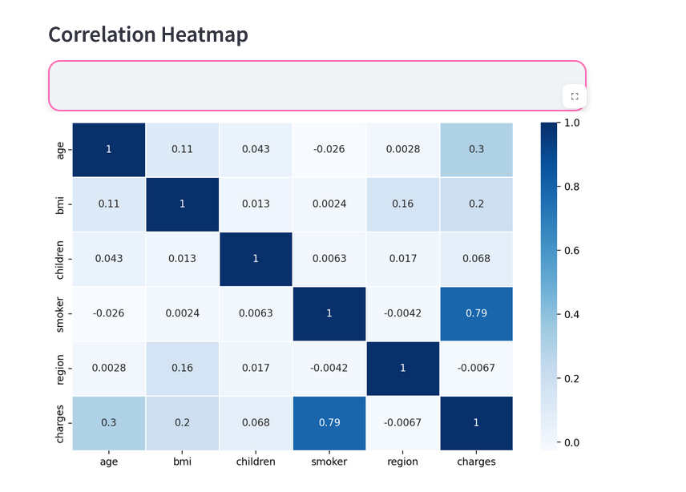

# 🏥 **Medical Insurance Predictor**

This project predicts medical insurance charges based on user inputs like age, gender, BMI, smoking habits, and region using **Random Forest Regression** and **Streamlit** for an interactive UI.

---

## 🖼️ **App Preview**
  
  
  


---

## 🚀 **Features**

- 🔍 Predicts medical insurance costs based on user input  
- 📊 Trained using Random Forest Regressor  
- 🧮 Performs EDA with visualizations  
- 🌐 Interactive UI with Streamlit  

---

## 🧠 **How it Works**

- 📁 The dataset is cleaned and preprocessed  
- 🧠 Random Forest Regression is applied for training  
- 🎛️ Users enter their information in the Streamlit form  
- 📈 The app predicts insurance cost instantly  

---

## 📂 **Project Structure**

- `insurance.csv` – Dataset  
- `app.py` – Streamlit web app  
- `eda.ipynb` – Exploratory Data Analysis  
- `model.pkl` – Trained ML model  
- `requirements.txt` – Dependencies  
- `README.md` – You’re here!  

---

## 📦 **Run it Locally**

1. **Clone the repository**  
   ```bash
   git clone https://github.com/Shivanee11/MedicalInsurancePredictor.git


👩‍💻 Author

👩‍💻 **Shivanee Rao**  
🎓 B.Tech CSE Student at KIIT University, Bhubaneswar (6th Semester)  
💡 Passionate about building intuitive web applications and diving deep into data analytics  
🌐 GitHub: https://github.com/Shivanee11
